# Marketing Campaign A/B Testing Analysis in Excel

## 🧾 **Introduction**
This project focuses on analyzing the performance of two distinct marketing campaigns, a Control Campaign and a Test Campaign, both conducted during the period from **August 1** to **August 30**.

The goal of this analysis is to evaluate the effectiveness of each campaign based on multiple performance metrics such as **spending, impressions, website clicks, searches, content views, add-to-cart actions, and purchases**.

A/B Testing was used as the primary framework for comparison. This technique allows marketers and analysts to assess whether the observed differences between two campaign strategies are **statistically significant** or simply the result of random variation.

By combining **descriptive analysis** with **statistical testing**, this project aims to identify which campaign achieved better results and provide insights that can guide future marketing decisions.

## 🎯 **Objective**
The main objective of this project is to **compare the performance** of the two marketing campaigns, Control and Test, to determine which one delivered better results during the campaign period.

Specifically, the analysis seeks to:

* Evaluate key performance metrics such as **Amount Spent, Impressions, Reach, Website Clicks, Searches, Content Views, Add to Cart, and Purchases**.

* Identify whether the observed differences between the two campaigns are **statistically significant** using hypothesis testing (T-test).

* Provide **data-driven insights** that can support marketing strategy optimization and improve future campaign performance.

Through this analysis, the project demonstrates how A/B testing can be used to guide **evidence-based decision-making** in digital marketing.

## 📊 **Dataset Description**
* **Data Source**: The dataset was synthetically generated to simulate real-world digital marketing performance data for two e-commerce campaigns.

* **Time Period**: From **August 1st** to **August 30th**, covering **30 days** of campaign performance.

* **Columns Description**:
    * `Campaign Name`: Identifier of the marketing campaign (Test Campaign
     or Control Campaign).

    * `Date`: The specific day of observation.

    * `Spend (USD)`: Total daily advertising spend in USD.

    * `# of Impressions`: Number of times the ad was displayed to users.

    * `Reach`: Number of unique users who saw the ad.

    * `# of Website Clicks`: Number of times users clicked the ad and visited the website.

    * `# of Searches`: Number of searches made by users after clicking the ad.

    * `# of View Content`: Number of times users viewed product details or content.

    * `# of Add to Cart`: Number of users who added products to their cart.

    * `# of Purchase`: Number of completed purchases resulting from the campaign.

* **Dataset Size**:
     **60** records in total (**30 days** for each campaign).
* **Notes**:
    * Some missing values and outliers were intentionally added to simulate real-world data imperfections.

    * Data cleaning and preparation were performed using Power Query to ensure data quality before analysis.

## 🧹**Data Cleaning**
Before conducting any statistical analysis, the dataset was carefully cleaned to ensure accuracy and consistency.

* **Outlier Treatment**:
 Outliers were identified using **Z-scores** and visually confirmed with **box plots**.
Any value with a Z-score outside the range of **-3 to +3** was considered a potential outlier.
In the control dataset, one outlier was detected in the **# of Searches** column and replaced with the **median** value.
 After correction, all variables were found to be within the acceptable range, indicating no remaining outliers.

* **Handling Missing Values**:
 Missing values were replaced with the **mean** of each column after verifying data consistency.
This approach helped maintain the overall statistical balance without introducing bias.

* **Data Type Verification**:
 Each column’s data type was reviewed to ensure compatibility with further analysis. 
    
    * **Numeric columns** were properly formatted for statistical tests.

    * **Date columns** were converted to the correct date format.

    * **Categorical fields** such as Campaign Name were standardized.

## **🔍 Exploratory Data Analysis (EDA)**
The goal of this step was to gain a clear understanding of both marketing campaigns (Control and Test groups) before conducting any hypothesis testing.

### **5.1 Descriptive Statistics**
Descriptive statistics were generated for all numerical variables, including:
**Spend (USD), # of Impressions, Reach, # of Website Clicks, # of Searches, # of View Content, # of Add to Cart, and # of Purchase**.

These tables summarize the **mean, median, standard deviation, variance, minimum, and maximum** values for each campaign.

They provide a quick overview of how the performance metrics differ between the two groups.
    
#### **Test Campaign Descriptive Statistics**: 

| Value / Feature | Spend [USD]	| # of Impressions | Reach | # of Website Clicks | # of Searches | # of View Content | # of Add to Cart | # of Purchase |
| --------------- | ----------- | ---------------- | ----- | ------------------- | ------------- | ----------------- | ---------------- | ------------- | 
| Minimum         | 1,968        | 22,521          | 10,598 | 3,038              | 1,854         | 858               | 278              | 238           |
| Maximum         | 3,112        | 133,771         | 109,834 | 8,264             | 2,978         | 2,801             | 1,391            | 890           |
| Average         | 2,563        | 74,585          | 53,492 | 6,032              | 2,419         | 1,858             | 882              | 521           |
| Median          | 2,584        | 68,854          | 44,220 | 6,243              | 2,396         | 1,881             | 974              | 500           |
| Standard Deviation | 349      | 32,121           | 28,796 | 1,709              | 389           | 598               | 348              | 211           |
| Variance        | 121,583      | 1,031,782,887   | 829,196,701 | 2,919,202     | 151,121       | 357,191           | 120,815          | 44,541        |

#### **Control Campaign Descriptive Statistics**: 

| Value / Feature | Spend [USD]	| # of Impressions | Reach | # of Website Clicks | # of Searches | # of View Content | # of Add to Cart | # of Purchase |
| --------------- | ----------- | ---------------- | ----- | ------------------- | ------------- | ----------------- | ---------------- | ------------- | 
| Minimum         | 1,757        | 71,274          | 42,859 | 2,277              | 1,001         | 848               | 442              | 222           |
| Maximum         | 3,083        | 145,248         | 127,852 | 8,137             | 3,549         | 4,219             | 1,913            | 800           |
| Average         | 2,288        | 109,560         | 88,845 | 5,321              | 2,135         | 1,944             | 1,300              | 523           |
| Median          | 2,300        | 112,368         | 91,418 | 5,272              | 2,340         | 1,980             | 1,320              | 506           |
| Standard Deviation | 367      | 21,312           | 21,453 | 1,727              | 687           | 764               | 400              | 182           |
| Variance        | 134,935      | 454,188,364   | 460,215,231 | 2,981,851     | 472,022         | 583,729           | 160,297          | 33,055        |

### **5.2 Box Plots**
Box plots were created for each numerical column to visualize the data distribution and confirm that outliers were successfully handled.

All plots were saved in **  ** resolution for clear presentation and future reference.

#### **Test Campaign Box Plots**:
The following plots show the data distribution for the test campaign metrics after cleaning:

  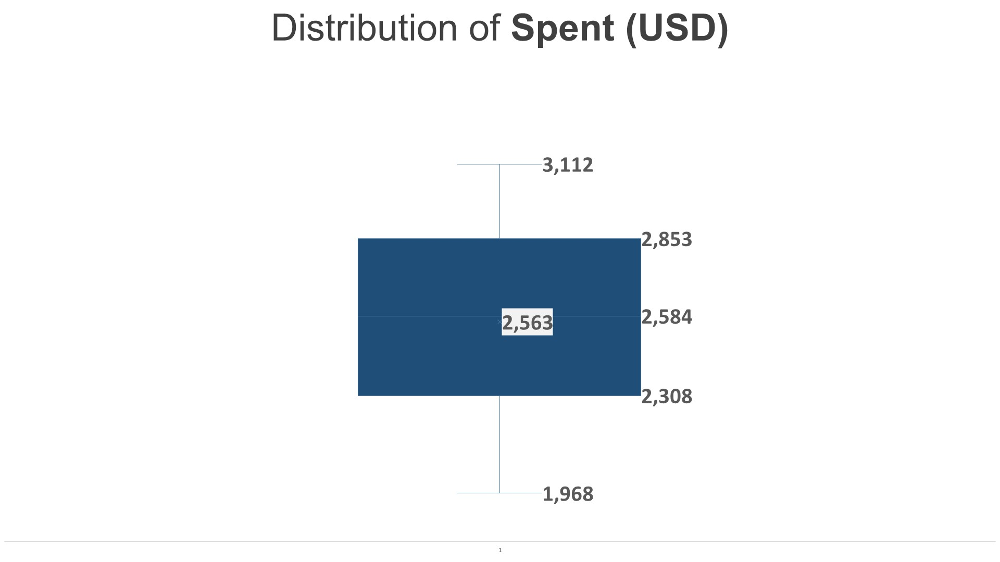
  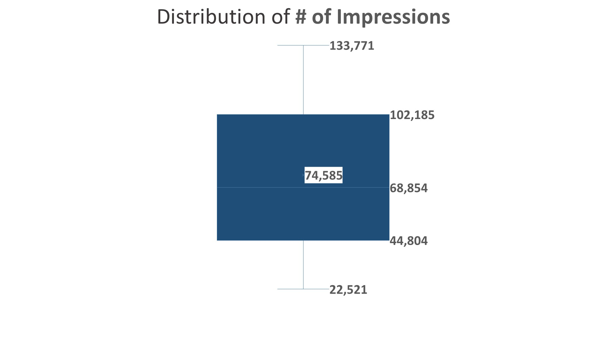

  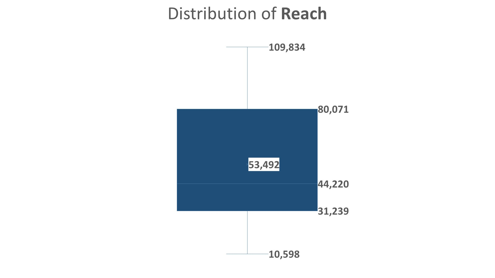
  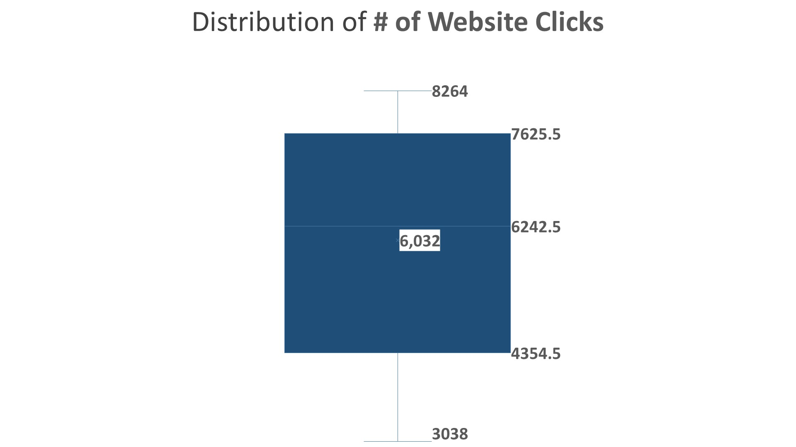

  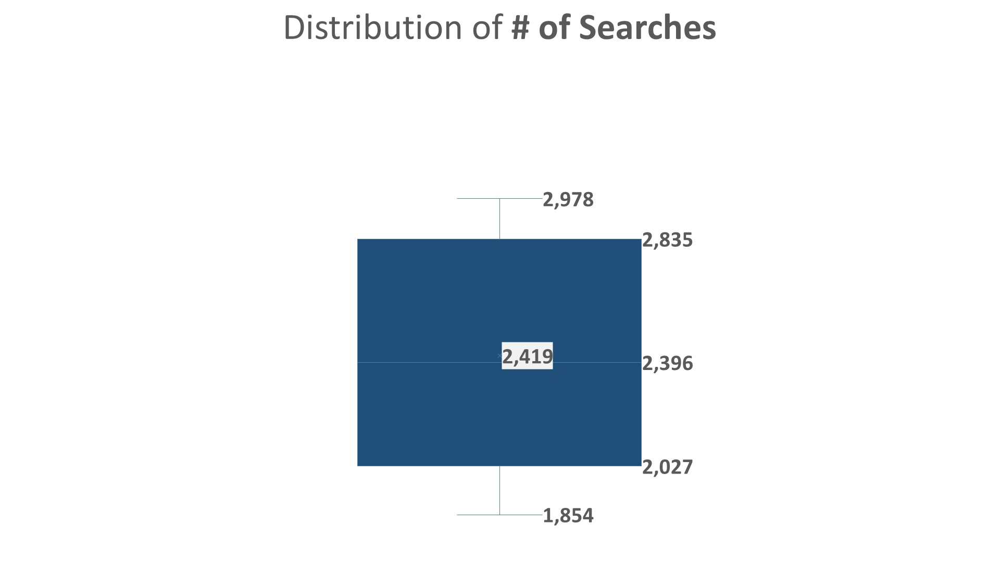
  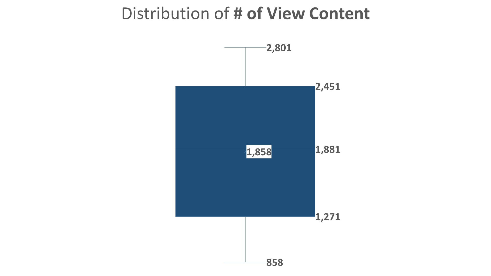

  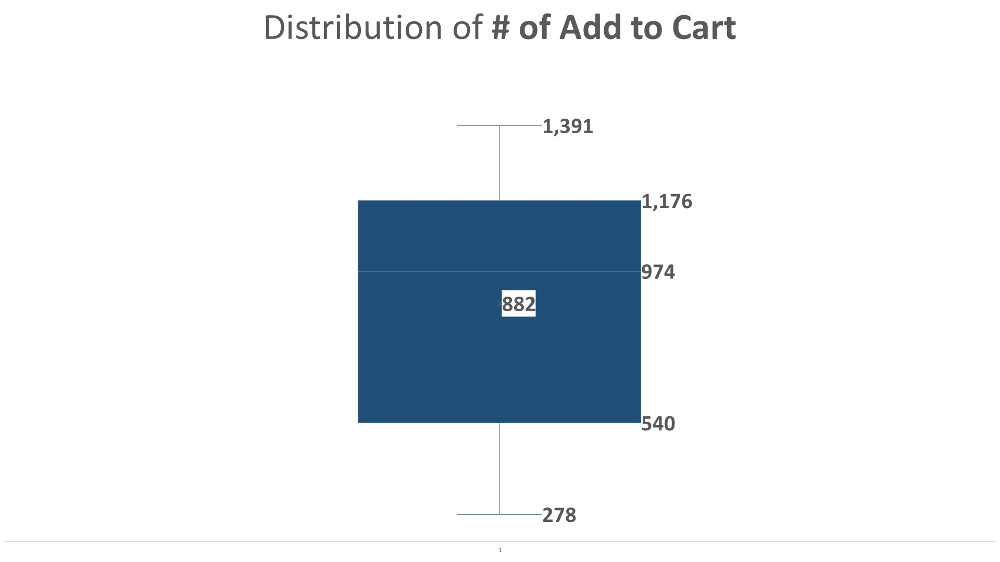
  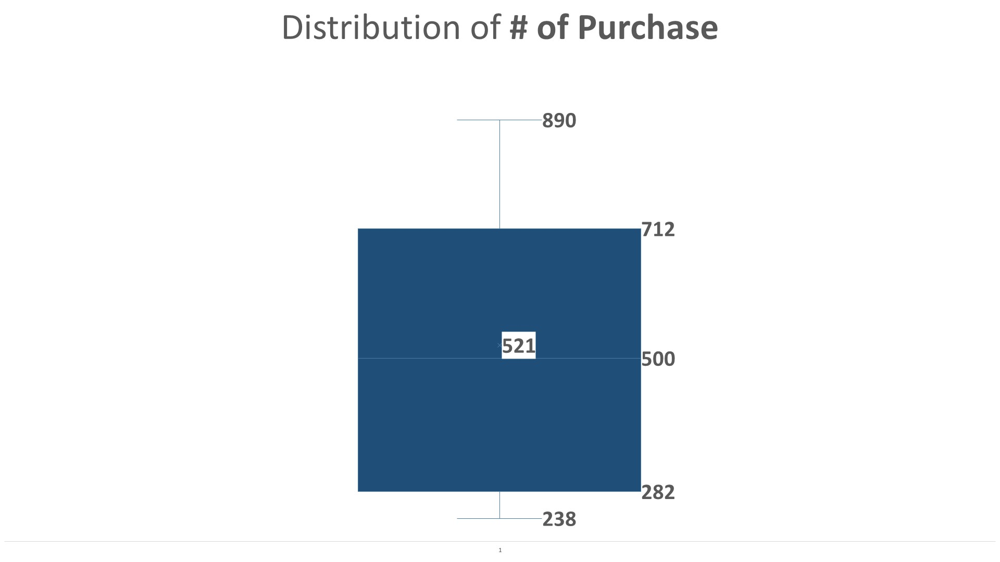

#### **Control Campaign Box Plots**:
Below are the box plots for the control campaign metrics after fixing outliers and missing values:

  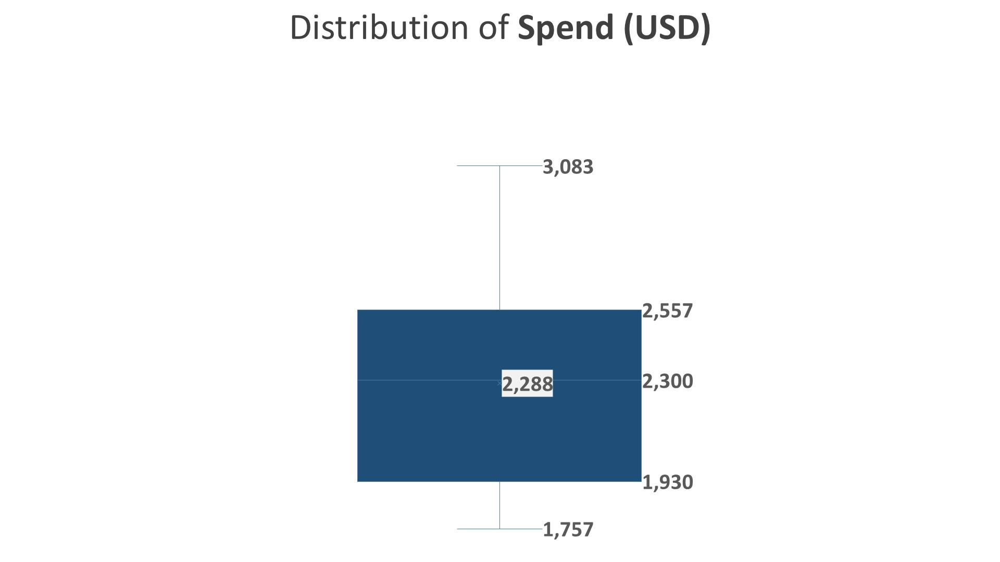
  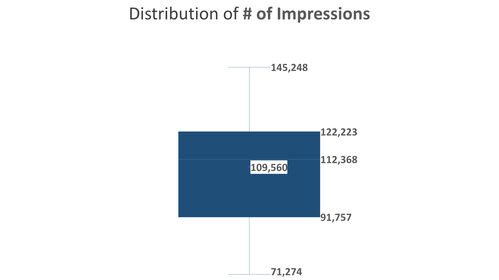

  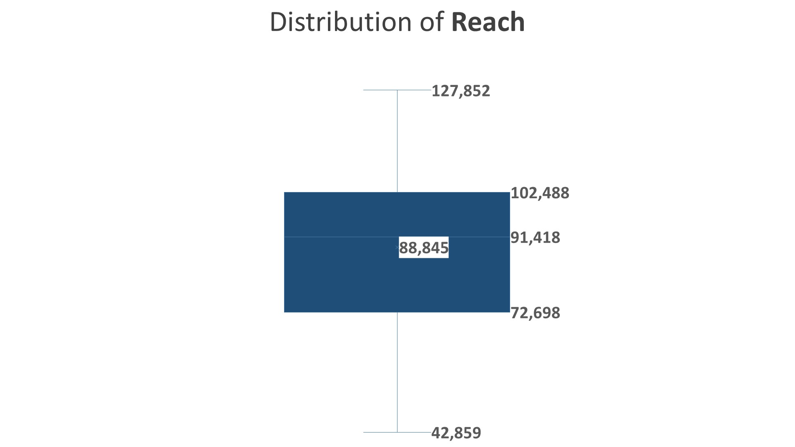
  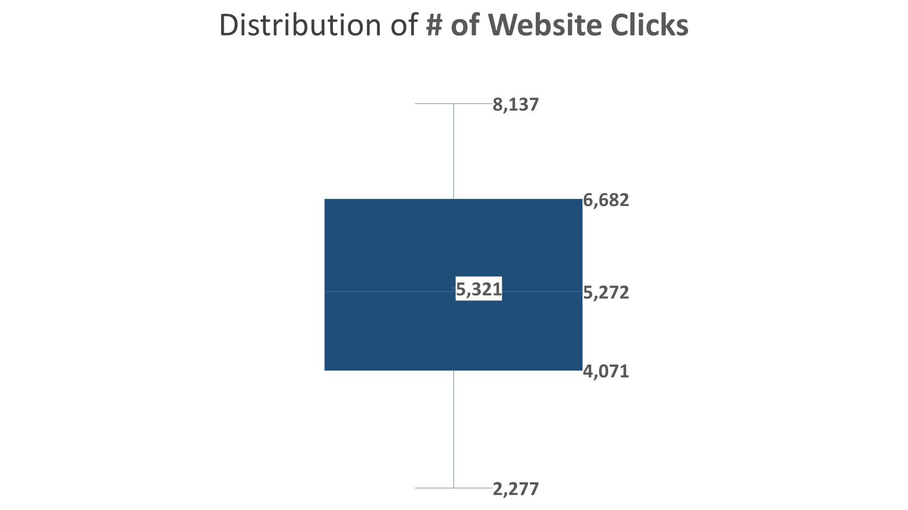

  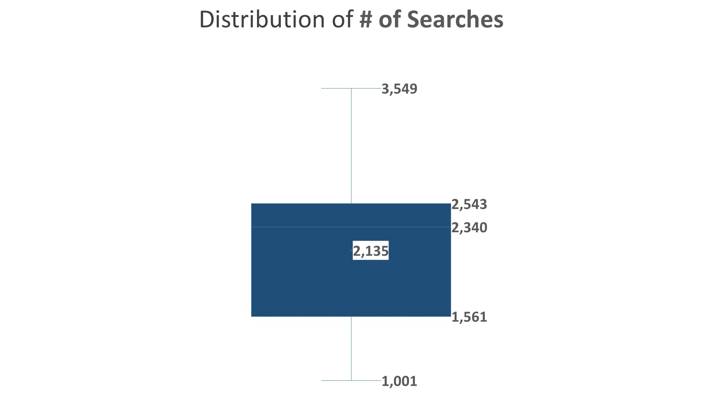
  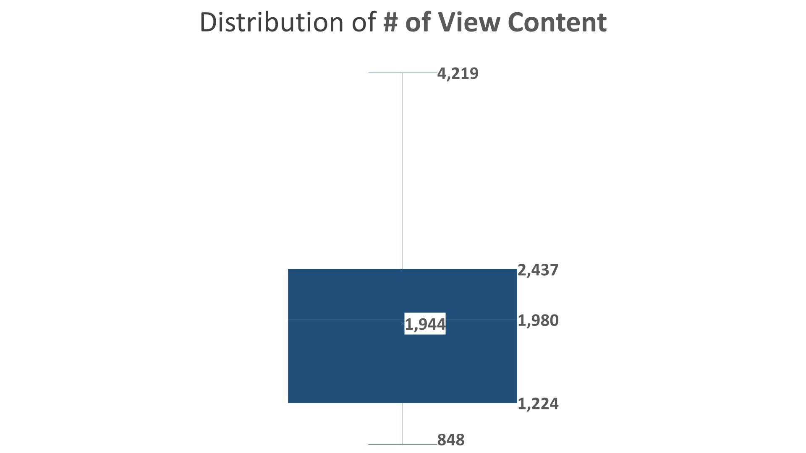

  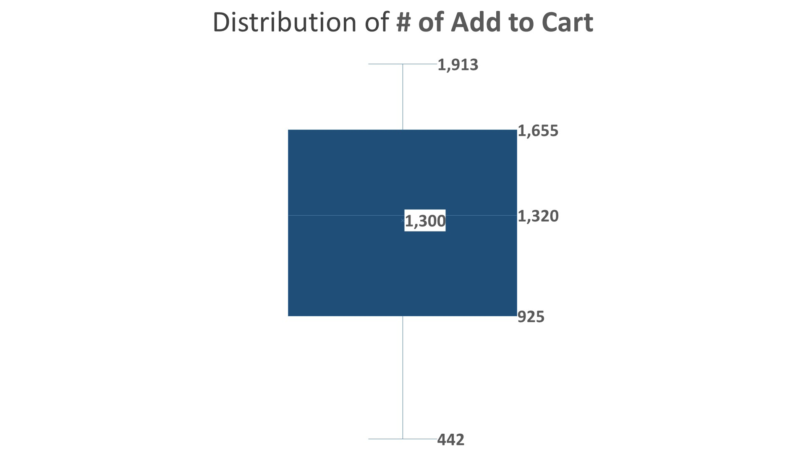
  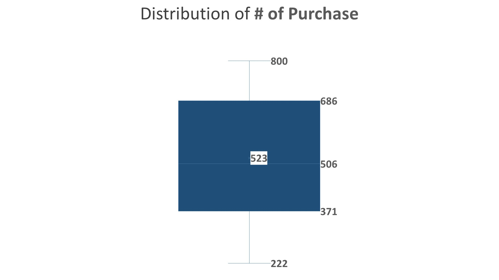

